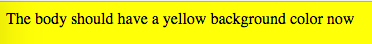

JavaScript Webpack "html-webpack-plugin" Demo
=============================================

It will generate a simple html page contains the generated bundle.js.

```
npm install
npm run demo
```

It will open the generated `index.html` automatically.

